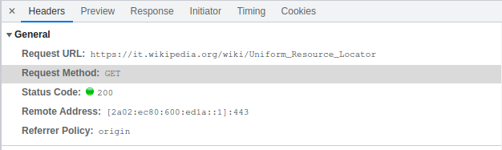

## HTTP

HTTP (Hypertext Transfer Protocol) è protocollo **applicativo** di tipo **stateless**, alla base del web. Il suo funzionamento è analogo a quello di altri protocolli che seguono un'**architettura client-server**: un client invia una richiesta al server e questo risponde con la risorsa d'interesse.

I messaggi di richiesta e risposta del protocollo HTTP sono detti: **HTTP Request** e **HTTP Response.**


### Struttura di una URL

Le URL (**Uniform Resource Locator**) sono il modo per identificare **univocamente** una risorsa sul web (ma non solo).
Le URL seguono una struttura del tipo:

```
[PROTOCOLO]://[DOMAIN]:[PORT]/[RESOURCE]?[QUERY][#FRAGMENT]
```

Le porte tipicamente utilizzate sul web sono la **80 (HTTP)** e **443 (HTTPS = HTTP + SSL a livello di trasporto)**


### HTTP VERBs

I verbs (anche detti **metodi**) indicano il tipo di azione che si sta compiendo quando si inoltra una **HTTP request**. Poniamo l'attenzione su:

- **`GET`**: non permette di inviare grossi moli di dati, perché i parametri sono passati in **query string**. Viene usato per ottenere risorse e passare parametri di poco ingombro.

- **`POST`**: il payload, `body`, è più grande rispetto alla `GET`, il che consente di mandare moli di dati più grande ( per questo motivo HTTP è **circa data-agnostico**)

- **`PUT`**: per l'update di una risorsa

- **`DELETE`**: per l'eliminazione di una risorsa

  

  

### STATUS CODE

Nei messaggi **HTTP Response** troviamo dei codici che ci informano dell'esito della richiesta effettuata, sono detti **status code**.

Il primo digit dello status è anche dello **classe**, indica il tipo di messaggio (se la richiesta è andata a buon fine, c'è stato un errore etc...).


Classi di status code:

- **1xx informazioni**
- **2xx successo**
- **3xx proveniente dalla cache** 
- **4xx client error message**
- **5xx server error messagge**


Messaggi tipici che vediamo sul web sono ad esempio:

- `404` (not found)
- `200` (risorsa servita correttamente)
- `304` (risorsa servita dalla cache, ancora valida)


------

### Note sul DNS

- `www` è un dominio di secondo livello, una chiave per il DNS.
- `ww3` solitamente è utilizzato per indicare i siti che si appoggiano a tecnologia Web3
- L'utilizzo del prefisso www nel tempo è andato a perdersi visto che è di fatto risolverlo è un sovraccarico al server DNS.


