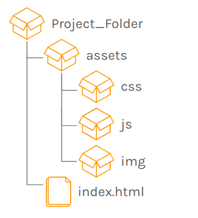
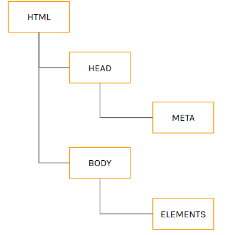
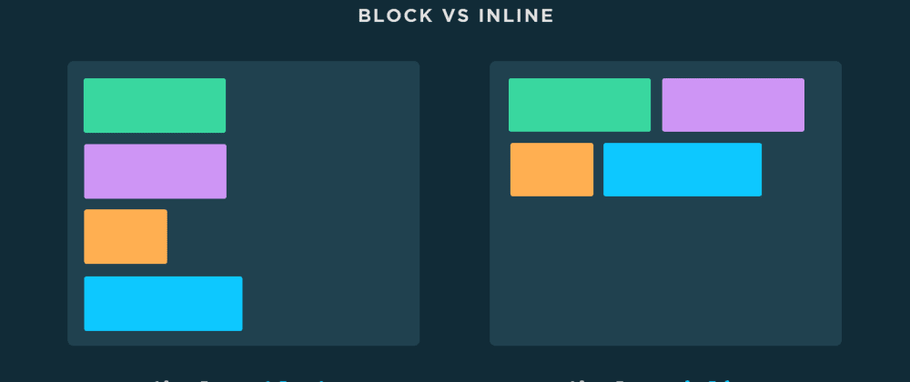

## HTML

HTML è un **linguaggio di markup**, ideato per la creazione di pagine web. La struttura della pagina web viene definita da elementi detti **tag**.

### Struttura di un progetto per un'applicazione web



Il file `index.html` è il primo file ad essere restituito (si dice anche "**servito dal web server**") nel momento in cui si accede ad un sito (a meno di route o regole di redirect differenti). Questo dipende dal server web, è una regola generale e diversamente configurabile.

Il tag `<!DOCTYPE>` serve per indicare al browser per indicare che il documento è di tipo HTML. Molti moderni browser solitamente riescono a comprenderlo da sé facendo analisi del documento, quindi non sempre è specificato.

Per HTML 5:

```html
<!DOCTYPE html>
```

Esistono varie tipologie di `DOCTYPE`, ad esempio l'**xml**, tipo quello utilizzato per i feed RSS

### Struttura di una pagina HTML

```html
<!DOCTYPE html>
<html>
	<head>
		<title> TITOLO </title>
        <!-- META INFO -->
	</head>
	<body>
        <!-- ELEMENTS -->
	</body>
</html>
```

Nel tag `head` troviamo i **meta**, ovvero le informazioni utili al browser per la resa ottimale della pagina, la lingua e l'orientamento del testo.
Nel tag `body` troviamo invece gli elementi della nostra pagina.

L'HTML segue una struttura ad **albero n-ario**, dove il tag `html` è il nodo radice.



Ogni elemento HTML ha un tag proprio e può contenerne degli altri. Quasi tutti i tag hanno un'apertura e una chiusura.

```html
<p> An HTML element </p>
```

Altrimenti sono detti **self-closing** o vuoti (void)

```html
<br> o <br/> è un tag inline
<hr> o <hr/> è un tag block
 o  è un tag inline
<input> o <input/>
```

Ogni elemento ha un proprio comportamento, una distinzione importante ad esempio è quella tra il comportamento `inline` e quello `block`



Un elemento dal comportamento `block` **occupa sempre il 100% dello spazio del proprio genitore** e **"rompe" il normale flusso degli elementi**, gli elementi `inline` invece non pregiudicano il comportamento degli altri elementi.

Sono elementi `inline`:

- `span`
- `b` (bold)
- `small`
- `a` (anchor)
- `i` (italic)

Sono elementi `block`:

- `p`
- `div`
- `h6`
- `h2`
- `ul`

Il tag `center` permette di centrare qualsiasi elemento `inline` al centro del proprio genitore.

------

Alcuni meta interessanti:

```html
<head>
    <meta charset="UTF-8"> <!-- indica la codifica -->
	<meta name="viewport" content="width=device-width, initial-scale=1.0"> <!-- indica la scala -->
</head>
```


Estensioni utili:

- Live Server (per servire le pagine, oppure è possibile spostarle su localhost)
- Ngrok

------

### Gli attributi

Gli elementi HTML possono avere degli attributi. Hanno una struttura `key="value"`.

Attributi nativi:

- `id`: per gli identificativi univoci
- `class`: per le classi css
- `style`: per lo stile inline
- `title`: descrizione, viene mostrato nel tooltip all'hover sull'elemento.

### Commenti

```html
<!-- Comment here -->
```

### Hyperlinks

```html
<a href="http://google.it" target="_blank">Click</a>
```

La URL specificata in `href` può essere

- **relativa**
- **assoluta**

`target` specifica invece su quale pagina/tab aprire la risorsa

I tag `a` servono anche per **creare delle ancore all'interno della stessa pagina**

```html
<a href="#test">Click here</a>
<p id="test"> Hello there!</p>
```

### Immagini

```html

```

È consigliato specificare una sola delle due dimensioni per evitare che l'immagine venga stretchata.
