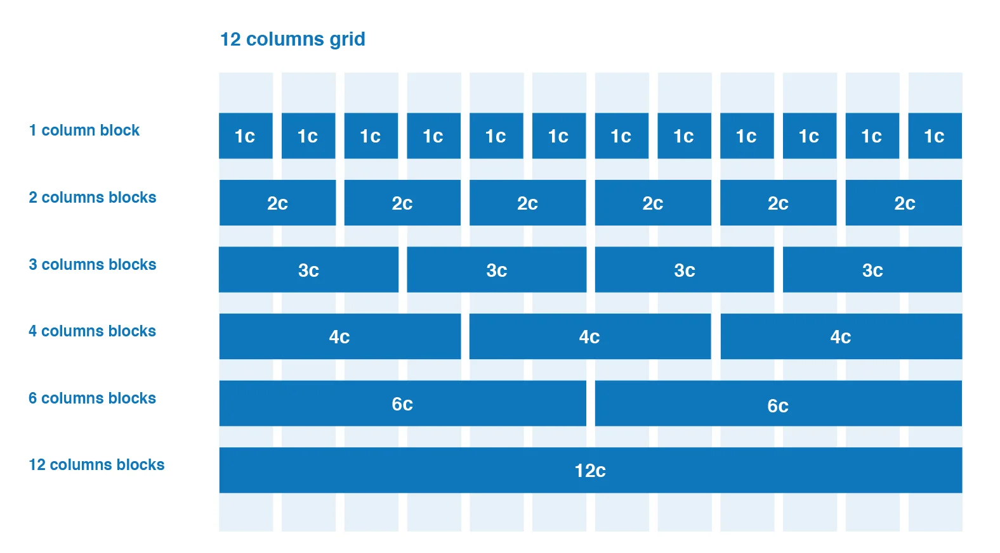

# Background

È possibile definire le proprietà dal background.

```css
background: green;

/** definisco la ripetizione sull'asse y **/
background: url("test.jpg") repeat-y;

background: border-box red;
background: no-repeat center/80% url("../img/image.png");
```

```css
/** Scala l'immagine in modo tale che copra tutto il container **/
background-size: cover;

/** Mantiene la scala, lasciando eventuali spazi rispetto al container **/
background-size: contain;

background-size: 50%;
background-size: 3.2rem;
```

È possibile specificare la posizione del background. Questo è molto utile ad esempio nel caso della size `cover`.

```css
background-position: center;
background-position: top;
```

# Cursor

È possibile specificare il tipo di cursore da mostrare quando si va in hover su un certo elemento

```css
cursor: pointer;
cursor: auto;

/**
*	url immagine
*	punta di interazione del cursore (partendo da alto a destra)
*	tipo di cursore
**/
cursor: url(cursor1.png) 4 12, auto;
cursor: url(cursor2.png) 2 2, pointer
```

# Overflow

Serve a definire il comportamento di un elemento container, qualora questo abbia un contenuto che eccede la sua dimensione.

```css
overflow: visible;

/* Nascondi il contenuto che eccede */
overflow: hidden;

/* Simile a hidden ma impedisce lo scroll */
overflow: clip;

/* Rende il container scrollabile */
overflow: scroll;

overflow:auto;

/* Nasconde il contenuto su l'asse X e lo rende visibile sull'asse Y */
overflow: hidden visible;

/* Overflow specifico per l'asse Y */
overflow-y: auto;
```

# Z-index

È possibile definire un posizionamento rispetto all'asse Z, così da scegliere quale elemento mostrare "più in alto".

```css
z-index: 1;
z-index: -1;
z-index: 99;
```

# Importare i file CSS

```css
/** Importo un file CSS da CSS**/
@import "miofilecss.css"
```

Per ogni file CSS da importare si esegue una chiamata HTTP.

# Importare font

```css
/** Importo un font da locale **/
@font-face{
    font-family: my-personal-font
    src: url(path_to_file)
}
```

Formati supportati:

- TTF
- OTF
- WOFF (ottimizzato per il web)
- SVG
- EOT

# Responsive layout

Al fine di stabilire uno standard, anche viste le molteplici risoluzioni ad oggi esistenti, si è passati al **sistema a colonne**. Il 100% è 12 colonne.




Un metodo semplice per definire il layout a colonne è quello di utilizzare i `float` e `clear`.

```css
* {
    box-sizing: border-box;
}

.row::after{
	content: "";
	clear: both;clear
	display: block;* {
    box-sizing: border-box;
}

}

[class*="col-"] {
    float: left;
    padding: 15px;
}
```

```css
.col-1 {width: 8.33%;}
.col-2 {width: 16.66%;}
.col-3 {width: 25%;}
.col-4 {width: 33.33%;}
.col-5 {width: 41.66%;}
.col-6 {width: 50%;}
.col-7 {width: 58.33%;}
.col-8 {width: 66.66%;}
.col-9 {width: 75%;}
.col-10 {width: 83.33%;}
.col-11 {width: 91.66%;}
.col-12 {width: 100%;}
```

```html
<div class="row">
    La mia sezione al 100%
    <div class="col-12">
        <div class="col-6">
            La mia sezione 1 al 50% della colonna più grande
        </div>
        <div class="col-6">
            La mia sezione 2 al 50% della colonna più grande
        </div>
    </div>
</div>
```

# Media query

Man mano che la risoluzione scala c'è bisogno di "ingrandire" e "restringere" gli elementi, cambiando dinamicamente le proprietà a seconda della risoluzione a cui ci troviamo. Facciamo questo definendo dei **break-point** attraverso le **media query**.

```css
/** Se scendo sotto i 900px di risoluzione lo sfondo diventa rosso **/
@media screen and (max-width: 900px){
	background: red;
}
```

```css
/** Su mobile imposto tutte le colonne al 100% **/
@media screen and (max-width: 768px){
    [class*="col-"]{
        width: 100%;
    }
}

/** Set di regole per mobile per risoluzione tra 600px e 768px (tablet) **/
@media only screen and (min-width:600px){
    .col-m-1 {width: 8.33%;}
	.col-m-2 {width: 16.66%;}
	.col-m-3 {width: 25%;}
	.col-m-4 {width: 33.33%;}
	.col-m-5 {width: 41.66%;}
	.col-m-6 {width: 50%;}
	.col-m-7 {width: 58.33%;}
	.col-m-8 {width: 66.66%;}
	.col-m-9 {width: 75%;}
	.col-m-10 {width: 83.33%;}
	.col-m-11 {width: 91.66%;}
	.col-m-12 {width: 100%;}
}

/** Per risoluzione desktop **/
@media only screen and (min-width: 768px) {
	.col-1 {width: 8.33%;}
	.col-2 {width: 16.66%;}
	.col-3 {width: 25%;}
	.col-4 {width: 33.33%;}
	.col-5 {width: 41.66%;}
	.col-6 {width: 50%;}
	.col-7 {width: 58.33%;}
	.col-8 {width: 66.66%;}
	.col-9 {width: 75%;}
	.col-10 {width: 83.33%;}
	.col-11 {width: 91.66%;}
	.col-12 {width: 100%;}
}
```

```css
<div class="col-6 col-m-12">
	Questo div su desktop occupa solo il 50%, mentre su mobile e tablet il 100%
</div>
```

Notazioni simili sono molto utilizzate da vari framework CSS, come ad esempio Bootstrap, per gestire al meglio i layout a risoluzioni differenti.