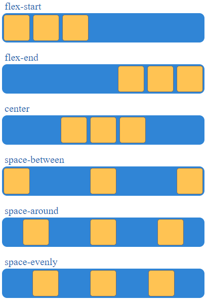

# Flexbox model

Un alternativa più versatile rispetto al modello a colonne già visto è il **flexbox model**. Il sistema flex prevede un **asse principale** e una **perpendicolare**. Gli elementi all'interno di un flex container si dispongono in relazione a questi due assi.

Distinguiamo due concetti:

- il **flex container**
- i suoi figli di primo livello, i **flex items**


Specifichiamo il comportamento flex dalla proprietà `display`:

```css
display: flex;
```

Attraverso l'impiego della proprietà `flex-direction` specifichiamo l'asse di riferimento.

```css
flex-direction: column; 	/* Mi riferisco all'asse perpendicolare */
flex-direction: row; 		/* Mi riferisco all'asse principale */
flex-direction: row-reverse;
flex-direction: column-reverse;
```

Di default la direzione è `row`.


Nel caso in cui l'item ecceda la dimensione del container possiamo specificare il comportamento attraverso la proprietà `flex-wrap`

```css
mio-container-flex{
    /* Se gli item eccedono la dimensione del container, mandali a capo */
    /* NB: se l'item non eccede la dimensione ha il comportamento ordinario */
    flex-wrap: wrap;
    flex-wrap: reverse-wrap;
}
```

## Flex items size

Possiamo specificare la dimensione dei singoli item all'interno del container, in **unità frazionarie** o **assolute**.

```css
mio-item{
    flex: 1; /* Occupa 1/n */
    flex: 200px; /* Occupa 200px */
    
    /*  
    Occupa 2/n dello spazio e devi avere una larghezza minima di 200px (nel 		caso la direzione sia row, nel caso sia column è altezza)
    */
    flex: 2 200px; 
}
```

## Flex-grow

È possibile specificare la quantità di spazio da occupare qualora ci sia spazio in più all'interno del container.

```css
mio-container-flex{
	flex-grow: 4;
}
```

## Allineamento

È possibile dare ulteriori direttive sull'allineamento

```css
div{
	display:flex;
	
	/** Rispetto all'altro asse, quello perpendicolare **/
	align-items: center;
	align-items: start;
	align-items: end;
	
	/**Rispetto all'asse principale, definisce la spaziatura tra gli elementi**/
	justify-content: space-around;

    /*Comportamento analogo ad around ma esclude i bordi*/
    justify-content: space-between;
}
```



## Ordinamento

È possibile indicare con che priorità mostrare gli elementi attraverso la proprietà `order`. La proprietà non da un indice specifico all'interno del container ma piuttosto una priorità. Più è alto il valore, più è alta la priorità.

```css
.container {
display: flex;
}

.item {
	order: 2
}
```

## Flex flow

Una proprietà riassunti di quelle già viste `flex-direction` e `flex-wrap` è `flex-flow`, dove è possibile specificare la direzione e il comportamento in caso di elementi che eccedono la dimensione del container.

```css
flex-flow: row wrap;
```

------

**Link utili**

- [Flexbox froggy](https://flexboxfroggy.com/#it)
- [Flexbox defense](http://www.flexboxdefense.com/) 

**Homework**: provare a fare un menu con flex-box e media query. **Slide n.159**