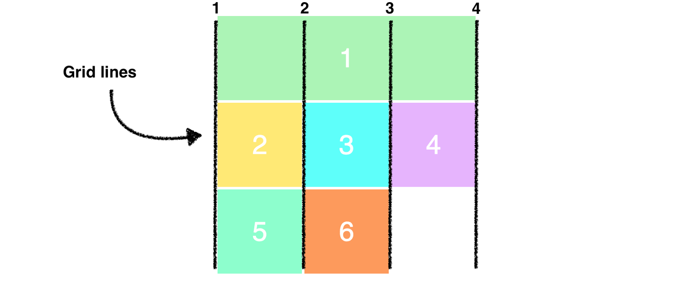
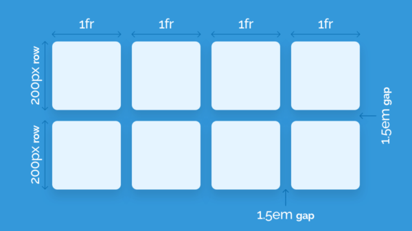
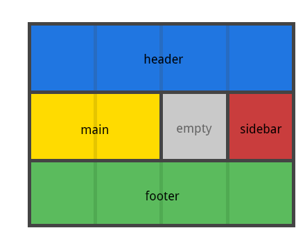

# Grid layout

Nel sistema grid si ha il controllo di entrambi gli assi (quindi bi-dimensionale).
A differenza del sistema precedente consideriamo **le linee (virtuali) che vanno a definire righe e colonne**.



```css
.container {
	display: grid;
}
```

A differenza del sistema `flex`, che in maniera automatica "assegna" proprietà ai propri figli, le proprietà della `grid` vanno esplicitate per avere dei cambiamenti visibili.

```css
.container {
	display: grid;
    /** Template delle colonne della griglia: **/
	/** 3 colonne dove ognuna è largha 200px **/
	grid-template-columns: 200px 200px 200px;
    
    /** 3 colonne ma invece di usare misure assolute uso le frazionarie **/
    grid-template-columns: 2fr 1fr 1fr;
}
```

Possiamo definire un gap tra i vari elementi della grid.

```css
gap: 20px;
/** Solo per le righe. Sta via via venendo deprecato **/
row-gap: 30px;

/** Solo per le colonne. Sta via via venendo deprecato **/
column-gap: 10px;
```

Possiamo definire degli alias per righe e colonne in modo tale da accedervi in seguito. È possibile assegnare a righe e colonne anche più nomi.

```css
.container {
	display: grid;
	grid-template-columns: [first] 40px [line2] 50px 
	[line3] auto [col4-start] 50px [five] 40px [end];
	grid-template-rows: [row1-start] 25% [row1-end] 100px 
	[third-line] auto [last-line];
}
```

Per suddividere le aree all'interno di una grid possiamo utilizzare le funzioni helper di CSS.

```css
.container {
	display: grid;
	/** Ripeti per 3 colonne, dimensione 1/3 per ciascuna **/
	grid-template-columns: repeat(3, 1fr);
	/** Dimensione minima: 100px. Dimensione massima: in base al contenuto **/
	grid-auto-rows: minmax(100px, auto);
    
	/** Posso anche combianare i metodi **/
    /** l'auto-fill permette il riempimento automatico in maniera responsive **/
    grid-template-columns: repeat(auto-fill, minmax(200px, 1fr));
}
```



## Grid line placement

La vera potenza del grid system si vede nel momento in cui possiamo dire ad un item esattamente come posizionarsi all'interno della grid.

```css
.item {
  grid-column-start: <number> | <name> | span <number> | span <name> | auto;
  grid-column-end: <number> | <name> | span <number> | span <name> | auto;
  grid-row-start: <number> | <name> | span <number> | span <name> | auto;
  grid-row-end: <number> | <name> | span <number> | span <name> | auto;
}
```

```css
.container {
    display: grid;
    grid-template-columns: [col-1] 100px [col-2] 100px
        [col-3] 100px [col-4] 100px [end];
    grid-template-rows: [row-1] 100px [row-2] 100px
        [row-3] 100px [row-4] 100px [end];
    gap: 20px;
}

.container .item {
    grid-colum-start: col-3;
    /** oppure **/
    /** prendo 2 colonne **/
    grid-column-start: span 2;

    grid-column-end: end;
    grid-row-start: span 2;
    grid-row-end: end;
}
```

```css
/* Possiamo utilizzare la notazioe compatta anche per queste proprietà */
.item-c {
	/* inizio / fine */
	grid-column: 3 / span 2;
  	grid-row: third-line / 4;
}
```

## Grid template placement

È possibile definire delle aree di appartenenza per le zone della grid.

```css
.grid {
    display: grid;
    grid-template-columns: 50px 50px 50px 50px;
    grid-template-rows: auto;
    /** Definisco l'area di appartenenza per i vari elementi della grid **/
    grid-template-areas:
        "header header header header"  /* prima riga */
        "main main . siderbar"		   /* seconda riga, il . lascia il vuoto */
        "footer footer footer footer";  /* terza riga */
}

.grid .header {
    /* Assegno all'elemento con classe header la grid-area header */
    grid-area: header;
} 
```



È possibile indicare l'area anche sull'oggetto stesso

```css
.item {
	grid-area: <name> | <row-start> / <column-start> / <row-end> / <column-end>;
}
```

È possibile allineare e giustificare gli elementi della `grid` come visto per `flex`.

**Homework**: slide 178.

# Scegliere un layout system

Tre alternative:

- **vanilla (sistema a colonne)**: semplice ma può essere ostico per componenti complesse
- **flexbox system**: adatto e comodo per single componenti
- **grid system**: adatto per dare il layout generale alle pagine

------

**Link utili**

- [Grid garden](https://cssgridgarden.com/#it)